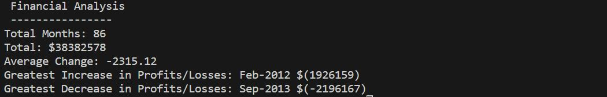
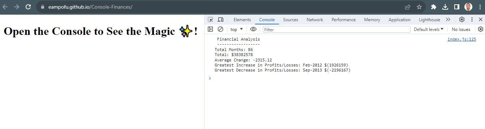

# Console-Finances

## Description

This is a simple javascript program that gives results for  the net amount of profit and loss, the average of the changes in profit and loss, the greatest increase in profit and the greatest decrease in loss. 
The values are stored in an array where you learn how to manipulate an array.

## Installation

N/A

## Usage 

Website link: https://eampofu.github.io/Console-Finances/

To view open up the console.

